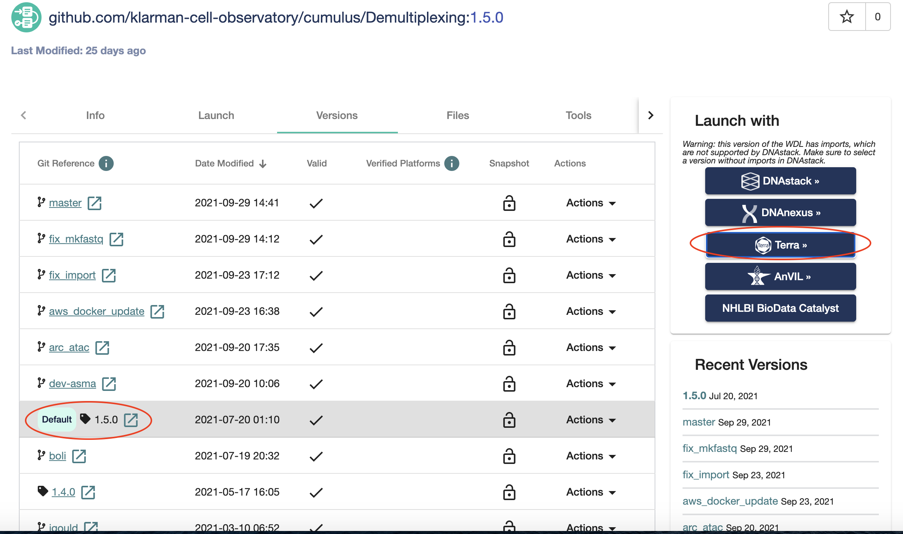

Import workflows to Terra
------------------------------------

Cumulus workflows are hosted on Dockstore_ under the organization of Broad Institute of MIT and Harvard.

1. The following page lists the `Cumulus collection of workflows`_. For purpose of illustration, we will describe process of importing Demultiplexing workflow in Terra. Click on View button beside "github.com/klarman-cell-observatory/cumulus/Demultiplexing".

.. image:: images/demult_workflow.png
   :scale: 60 %
   :align: center

3. Switch version using the Versions tab. In "Git Reference column" select the appropriate version to import into Terra. Then Launch with Terra (illustrated below).

3. Optionally rename the workflow and select a workspace on Terra where you have access to execute workflows and click IMPORT. This will take you to Terra from where you can launch the workflow by providing required inputs.

.. image:: images/workflow_name.png
   :scale: 60 %
   :align: center

.. _Dockstore: https://dockstore.org/
.. _Cumulus collection of workflows: https://dockstore.org/organizations/BroadInstitute/collections/Cumulus 
