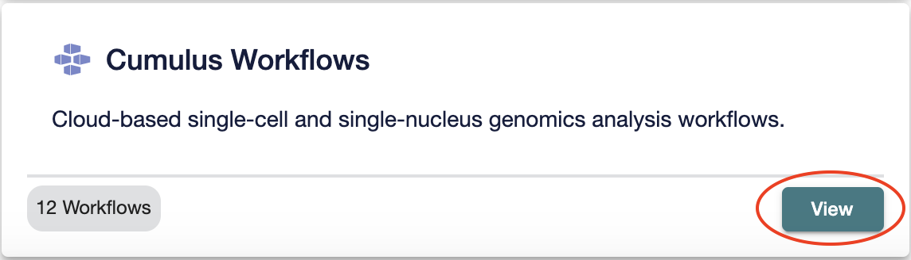
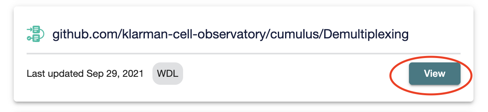
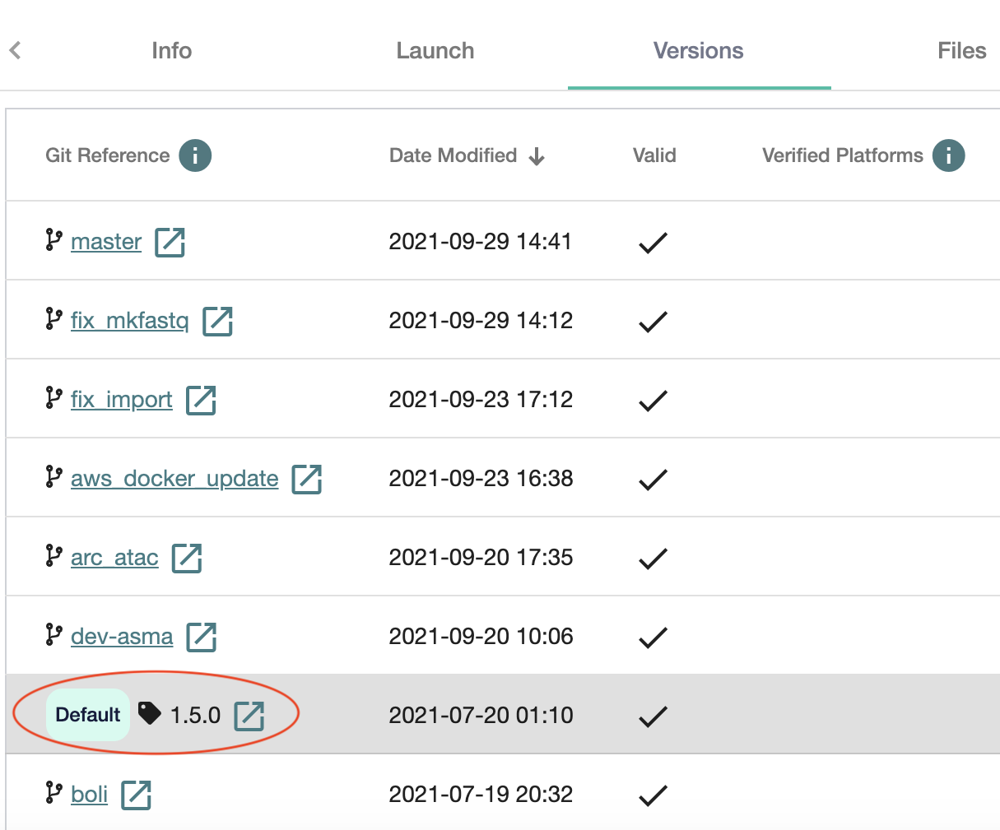
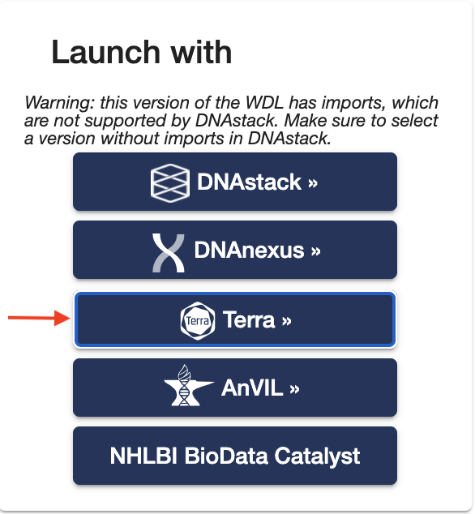

Import workflows to Terra
------------------------------------

Import from Dockstore to Terra
~~~~~~~~~~~~~~~~~~~~~~~~~~~~~~~~~~~~~~~~~~~~

1. Cumulus workflows are hosted on Dockstore_ under organization of Broad Institute of MIT and Harvard. Select "Cumulus Workflows" in Dockstore. 

2. For purpose of illustration, we will describe process of importing Demultiplexing workflow in Terra. Click on View button beside "github.com/klarman-cell-observatory/cumulus/Demultiplexing".

3. Switch version using the Versions tab. In "Git Reference column" select the appropriate version to import into Terra. 

4. Then Launch with Terra (illustrated below).

5. Type in an appropriate "Workflow Name" & Select a workspace on Terra where you have access to execute workflows.

.. _Dockstore: https://dockstore.org/organizations/BroadInstitute 
