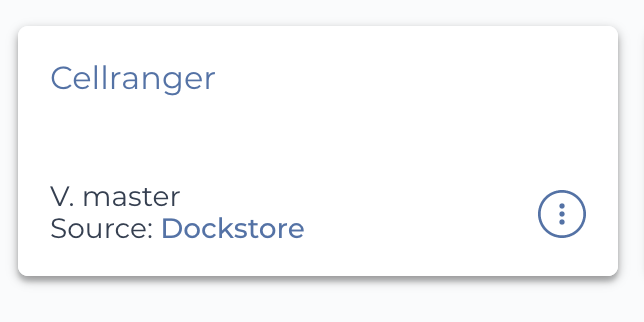

Import workflows to Terra
------------------------------------

Cumulus workflows are hosted on Dockstore_ under the organization of *Li Lab*. For illustration, we'll use *Cellranger* workflow to show how to import Cumulus workflows to your Terra_ workspace.

1. Select *Cellranger* workflow from `Cumulus workflow collection`_ by clicking its "View" button:

Notice that all Cumulus workflows have ``github.com/lilab-bcb/cumulus/`` prefix, which indicates they are imported from Cumulus GitHub repo to Dockstore.

2. In the workflow page, by switching to "Versions" tab, you can view all the available versions of *Cellranger* workflow, where the default version is on the top:

.. image:: images/step2.png
   :scale: 40%
   :align: center

To change to a non-default version, simply clicking the version name in "Git Reference" column. After that, click "Terra" button on the right panel.

.. note::
   The **master** version refers to the development branch of Cumulus workflows, which is always under rapid change. For stable usage, please always refer to a `released version`_.

3. You'll be asked to log in to Terra if not. Then you can see the following page:

In "Destination Workspace" drop-down menu on the right panel, you can select the target Terra workspace to import *CellRanger* workflow. Optionally, you can even rename the workflow in "Workflow Name" field. When everything is done, click "IMPORT" button below to finish.

4. When finished, you can see *Cellranger* workflow appearing in "WORKFLOWS" tab of your Terra workspace:

Moreover, in its workflow page (as below)

you can even switch the workflow's version in "Version" drop-down menu, and click the link in "Source" field to view the workflow's WDL source code.

.. _Dockstore: https://dockstore.org/
.. _Cumulus workflow collection: https://dockstore.org/organizations/lilab/collections/Cumulus
.. _Terra: https://app.terra.bio/
.. _released version: ./release_notes.html
